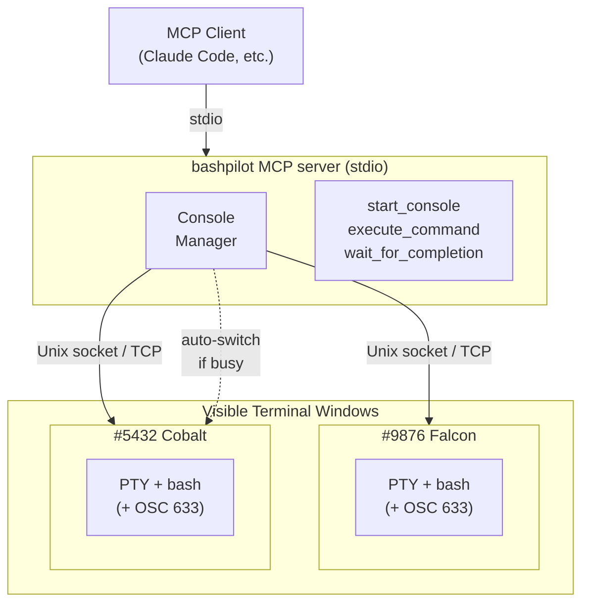

# bashpilot

Shared console MCP server for bash. AI and user work in the same terminal session.

## What This Does

AI calls `start_console` and a bash terminal window opens. You type commands as usual. When AI sends commands via MCP, they appear in the same terminal — you see every command and its output in real time. Session state (cwd, env vars, functions) persists across calls.

This is the same "shared console" concept as [PowerShell.MCP](https://github.com/yotsuda/PowerShell.MCP), implemented for bash using [VS Code's shell integration](https://code.visualstudio.com/docs/terminal/shell-integration) approach (OSC 633 escape sequences).

## Architecture



## Quick Start

### Register with Claude Code

```bash
claude mcp add bashpilot -- npx bashpilot
```

That's it. Claude Code will start bashpilot automatically. When AI calls `start_console`, a terminal window opens.

### Or install globally

```bash
npm install -g bashpilot
claude mcp add bashpilot -- bashpilot
```

## MCP Tools

| Tool | Description |
|------|-------------|
| `start_console` | Open a visible bash terminal window. Returns system info (user, hostname, OS) and cached outputs from other consoles. Reuses standby console if available. Pass `reason` to force a new one. |
| `execute_command` | Run a command in the shared terminal. Output is visible to user in real time and returned via MCP with a status line (duration, cwd, exit code). Cached outputs from other consoles are included. If the active console is busy or closed, auto-switches to another. |
| `wait_for_completion` | Wait for busy console(s) to finish and retrieve cached output. Use after a command times out. |

## Console Management

bashpilot manages multiple console windows automatically:

- **Auto-switch on busy**: If the active console is executing a long command, the next `execute_command` switches to a standby console (or launches a new one) without executing — you're asked to verify the directory first.
- **Auto-switch on closed**: If the active console window is closed, bashpilot detects it, reports which console was closed, and switches to another (or launches a new one).
- **Auto-launch**: If no console exists when `execute_command` is called, one is launched automatically.
- **Output caching**: When a command times out, the console continues running it and caches the output. Retrieve it with `wait_for_completion`, or it's automatically included in the next `start_console` or `execute_command` response.
- **Display names**: Each console gets a memorable name (e.g., "#9876 Falcon") shown in the window title and status lines.

## Response Format

Every `execute_command` response includes a status line:

```
✓ #9876 Falcon | Status: Completed | Pipeline: npm install | Duration: 12.34s | Location: /home/user/project
```

When a command times out:

```
⧗ #9876 Falcon | Status: Busy | Pipeline: npm install

Use wait_for_completion tool to wait and retrieve the result.
```

## How It Works

1. **MCP client starts bashpilot** via stdio (no manual terminal startup needed).

2. **`start_console`** launches a visible terminal window running bash with shell integration. The window is named (e.g., "bashpilot — #9876 Falcon").

3. **Shell integration**: A small script hooks into `PROMPT_COMMAND` and the `DEBUG` trap to emit OSC 633 markers for command lifecycle tracking, including current working directory (`OSC 633;P;Cwd=<path>`).

4. **`execute_command`** writes the command to the PTY. The user sees it in the terminal. Output is captured and returned via MCP.

5. **Dual streaming**: Output goes to the terminal (user sees it) AND is captured for the MCP response simultaneously.

6. **Console discovery**: Each console listens on a Unix domain socket (or TCP with port file on Windows) with a naming convention that encodes ownership. The proxy discovers consoles by scanning the filesystem. Stale files from dead proxy processes are cleaned up on startup.

## Supported Platforms

- Linux (native bash)
- macOS (native bash / zsh with bash installed)
- Windows (Git Bash via MSYS2)

## Limitations

- Only one command per console at a time (auto-switches to new console if busy)
- Very long output (>1MB) is truncated
- Interactive commands (vi, top, etc.) are not supported via MCP
- The user must keep the terminal window(s) open
- Characters typed during console startup may interfere with the first AI command

## License

MIT
