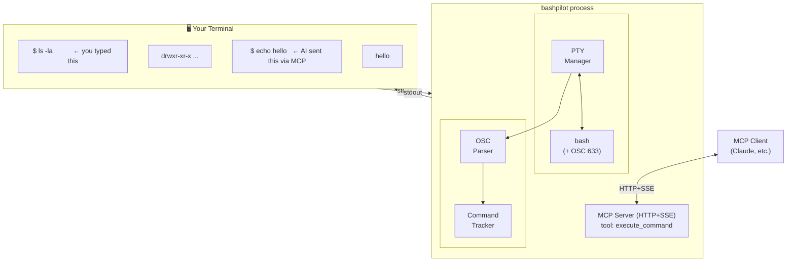

# bashpilot

Shared console MCP server for bash. AI and user work in the same terminal session.

## What This Does

When you run `bashpilot`, it opens a bash terminal. You type commands as usual. When an AI assistant sends commands via MCP, they appear in the same terminal — you see every command and its output in real time.

This is the same "shared console" concept as [PowerShell.MCP](https://github.com/yotsuda/PowerShell.MCP), implemented for bash using [VS Code's shell integration](https://code.visualstudio.com/docs/terminal/shell-integration) approach (OSC 633 escape sequences).

## Architecture



## Quick Start

```bash
npm install -g bashpilot
bashpilot
```

Or run directly with npx:
```bash
npx bashpilot
```

MCP server starts on `http://localhost:8818/sse` by default.

### Register with Claude Code

```bash
claude mcp add --transport sse bashpilot http://localhost:8818/sse
```

Then start `bashpilot` in a terminal window and use Claude Code as usual. AI commands will appear in the bashpilot terminal.

## Options

```
bashpilot [options]

  --port PORT    MCP server port (default: 8818)
  --shell SHELL  Shell to use (default: $SHELL or bash)
```

## How It Works

The key insight comes from VS Code's shell integration: inject [OSC 633](https://code.visualstudio.com/docs/terminal/shell-integration#_supported-escape-sequences) escape sequences into bash's prompt to track command lifecycle without modifying bash itself.

1. **Shell integration injection**: On startup, bashpilot sources a small script that hooks into `PROMPT_COMMAND` and the `DEBUG` trap to emit OSC 633 markers:
   - `OSC 633;C` — Command is about to execute
   - `OSC 633;D;N` — Command finished with exit code N
   - `OSC 633;A` — Prompt is being displayed

2. **Command execution**: When AI sends a command via MCP, it's written to the same PTY that the user is using. The command and its output appear in the terminal.

3. **Output capture**: The OSC parser strips markers from the output stream, feeds events to the command tracker, and the tracker captures output between execution and prompt display. ANSI sequences are stripped, command echo is removed, and the clean output is returned via MCP.

4. **Dual streaming**: Output goes to the terminal (user sees it) AND is captured for the MCP response simultaneously.

## Supported Platforms

- Linux (native bash)
- macOS (native bash or zsh with bash installed)
- Windows (WSL or Git Bash via MSYS2)

## Limitations

- Only one AI command can execute at a time (commands are serialized)
- Very long output (>1MB) is truncated
- Interactive commands (vi, top, etc.) are not supported via MCP
- The user must keep the bashpilot terminal window open

## License

MIT
