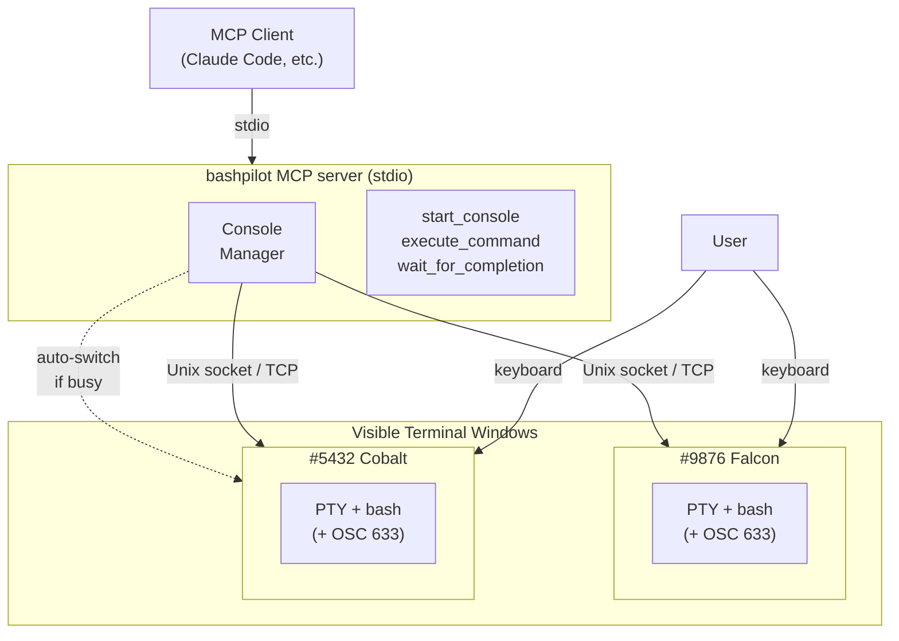

# bashpilot

Shared console MCP server for bash. AI and user work in the same terminal session.

<div align="center">
  
</div>

## PowerShell.MCP or bashpilot?

If you can install [PowerShell 7](https://learn.microsoft.com/en-us/powershell/scripting/install/installing-powershell) on your system, we strongly recommend **[PowerShell.MCP](https://github.com/yotsuda/PowerShell.MCP)** instead. It offers deeper engine integration, structured output, LLM-optimized text editing cmdlets, and works on Windows, Linux, and macOS.

**Use bashpilot when:**
- PowerShell 7 cannot be installed (e.g., restricted corporate PCs, minimal containers)
- You need to run existing bash/shell scripts with AI assistance
- Your workflow is built around bash tools (sed, awk, jq, grep pipelines)

## What This Does

AI and user share a visible bash terminal. When AI sends commands via MCP, they appear in the terminal — you see every command and its output in real time. You can also type in the same terminal to assist AI (e.g., enter passwords, answer prompts, or take over mid-task).

This enables collaborative workflows that non-shared tools can't support:
- **Long-running commands** (npm install, docker build) — progress visible in real time
- **Interactive prompts** (ssh password, git commit editor, setup wizards) — AI starts it, user responds
- **Session persistence** — env vars, venv activation, ssh connections, shell functions persist across commands

## Architecture



## Quick Start

### Register with Claude Code

```bash
claude mcp add bashpilot -- npx bashpilot
```

That's it. Claude Code will start bashpilot automatically. When AI calls `start_console`, a terminal window opens.

### Or install globally

```bash
npm install -g bashpilot
claude mcp add bashpilot -- bashpilot
```

### Claude Desktop

Add to your config file (`%APPDATA%\Claude\claude_desktop_config.json` on Windows, `~/Library/Application Support/Claude/claude_desktop_config.json` on macOS):

```json
{
  "mcpServers": {
    "bashpilot": {
      "command": "npx",
      "args": ["bashpilot"]
    }
  }
}
```

Restart Claude Desktop after saving.

## MCP Tools

| Tool | Description |
|------|-------------|
| `start_console` | Open a visible bash terminal window. Returns system info and cached outputs from other consoles. Reuses standby console if available. Pass `reason` to force a new one. |
| `execute_command` | Run a command in the shared terminal. Output is visible to user in real time and returned via MCP with a status line (duration, cwd, exit code). If the active console is busy or closed, auto-switches to another. |
| `wait_for_completion` | Wait for busy console(s) to finish and retrieve cached output. Use after a command times out. |

## Console Management

bashpilot manages multiple console windows automatically:

- **Auto-switch on busy**: If the active console is executing a long command, the next `execute_command` switches to a standby console (or launches a new one) without executing — you're asked to verify the directory first.
- **Auto-switch on closed**: If the active console window is closed, bashpilot detects it, reports which console was closed, and switches to another (or launches a new one).
- **Auto-launch**: If no console exists when `execute_command` is called, one is launched automatically.
- **Output caching**: When a command times out, the console continues running it and caches the output. Retrieve it with `wait_for_completion`, or it's automatically included in the next `start_console` or `execute_command` response.
- **Display names**: Each console gets a memorable name (e.g., "#9876 Falcon") shown in the window title and status lines.
- **Unowned consoles**: Consoles can exist without a proxy connection. When the proxy (MCP client) disconnects, consoles revert to unowned state and can be reclaimed by a new proxy session.

## Response Format

Every `execute_command` response includes a status line:

```
✓ #9876 Falcon | Status: Completed | Pipeline: npm install | Duration: 12.34s | Location: /home/user/project
```

When a command times out:

```
⧗ #9876 Falcon | Status: Busy | Pipeline: npm install

Use wait_for_completion tool to wait and retrieve the result.
```

## How It Works

1. **MCP client starts bashpilot** via stdio (no manual terminal startup needed).

2. **`start_console`** launches a visible terminal window running bash inside a PTY with [OSC 633 shell integration](https://code.visualstudio.com/docs/terminal/shell-integration) for command lifecycle tracking.

3. **Shared PTY**: Both user keyboard input and AI commands go through the same PTY. Output is displayed in the terminal AND captured for the MCP response simultaneously (dual streaming).

4. **Console discovery**: Each console listens on a Unix domain socket (or TCP with port file on Windows) with a naming convention that encodes ownership. The proxy discovers consoles by scanning the filesystem.

5. **Ownership lifecycle**: Consoles track their proxy's liveness. If the proxy dies, the console reverts to unowned state (socket renamed). A new proxy can discover and reclaim unowned consoles automatically.

## Supported Platforms

- Linux (native bash)
- macOS (native bash / zsh with bash installed)
- Windows (Git Bash via MSYS2)

## Limitations

- Only one command per console at a time (auto-switches to new console if busy)
- Very long output (>1MB) is truncated
- Interactive commands (vi, top, etc.) are not supported via MCP — but user can interact with them directly in the terminal
- Characters typed during console startup may interfere with the first AI command

## Related

- [PowerShell.MCP](https://github.com/yotsuda/PowerShell.MCP) — The same shared console concept for PowerShell, with deeper engine integration

## License

MIT
